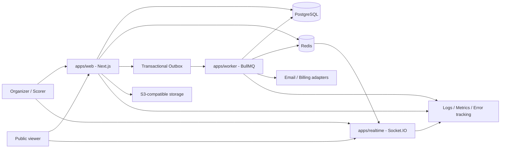

# 04 - Kiến trúc và stack kỹ thuật

## 1. Kiến trúc đã chọn

Business core là modular monolith trong monorepo TypeScript. Các process web, realtime và worker tách theo đặc tính runtime nhưng dùng chung domain/contracts và một PostgreSQL. Không tách microservice/database riêng trong MVP.



## 2. Stack khóa

| Lớp                  | Công nghệ                                                          | Ghi chú                                                               |
| -------------------- | ------------------------------------------------------------------ | --------------------------------------------------------------------- |
| Package/runtime      | pnpm workspace, Node.js LTS                                        | Patch version khóa tại P0; Corepack bật.                              |
| Web/BFF              | Next.js App Router, React, TypeScript strict                       | Server Components mặc định; Client Component khi tương tác cần thiết. |
| UI                   | Tailwind CSS, accessible headless primitives, shared `packages/ui` | Không copy component phân tán.                                        |
| Validation/contracts | Zod hoặc schema library thống nhất được khóa ở P0                  | Cùng schema cho input/API, không thay domain invariant.               |
| Database             | PostgreSQL + Prisma                                                | Migration có review; SQL constraint/index rõ.                         |
| Cache/queue          | Redis + BullMQ                                                     | Redis không giữ record chuẩn duy nhất.                                |
| Realtime             | Socket.IO + Redis adapter                                          | WebSocket long-lived; sequence + resync.                              |
| Object storage       | S3-compatible                                                      | Logo/import/export; local dùng MinIO hoặc adapter file test.          |
| Auth                 | Email/password Argon2id, DB session cookie                         | OAuth deferred.                                                       |
| Tests                | Vitest, fast-check, Playwright, Testcontainers, k6                 | Theo test pyramid và release gate.                                    |
| Deploy               | Docker Compose trên VPS/VM, reverse proxy TLS                      | Staging và production tách cấu hình/data.                             |
| Observability        | structured logger, error tracker, Prometheus-compatible metrics    | Provider cụ thể có thể chọn trong P0 không đổi contract.              |

## 3. Cấu trúc workspace mục tiêu

```text
AutoBracket/
  apps/
    web/                 # Next.js dashboard, public pages, HTTP API/BFF
    realtime/            # Socket.IO auth, room, sequence/resync adapter
    worker/              # outbox dispatcher, email, export, recompute jobs
  packages/
    domain/              # pure rules: draw, schedule, score, standings, permissions types
    db/                  # Prisma schema/client/repositories/transactions
    ui/                  # reusable accessible UI primitives/patterns
    contracts/           # API/event schemas and stable error codes
    config/              # eslint, tsconfig, env schema, test config
    testkit/             # fixtures/builders/containers shared
  infra/
    docker/              # images, compose, reverse proxy
    monitoring/          # dashboards/alerts
  scripts/               # repo guard, seed, smoke, backup helpers
  Plan/
  AGENTS.md
  package.json
  pnpm-workspace.yaml
  pnpm-lock.yaml
```

Nếu P0 cần đổi tên package phải có lý do và cập nhật D-003 bằng CR; không tự tạo thêm app/service.

## 4. Module business trong `apps/web`/domain

- `identity`: user, credentials, session, verification, recovery.
- `entitlements`: tier, quota, subscription, feature gates.
- `tournaments`: tournament config, lifecycle, settings, staff.
- `participants`: member, team, roster, registration, import.
- `competition`: stage, draw, group, bracket, schedule, revision.
- `scoring`: match command, score event, result, projection.
- `publishing`: public snapshot, slug, cache invalidation, SEO.
- `communications`: announcement, notification, email intent.
- `audit`: immutable actor/action/resource trail.
- `admin`: privileged support operations, không bypass domain command.

Module không truy cập table module khác tùy ý. Giao tiếp qua service contract/repository/query rõ ràng; domain package không import Next.js, Prisma, Socket.IO hoặc filesystem.

## 5. Request/command flow

### Query

1. Route/server action parse + validate input.
2. Resolve identity/tournament role/entitlement.
3. Query service đọc projection/repository.
4. Serialize DTO đã lọc private field.
5. Public response có cache policy/ETag phù hợp.

### Command quan trọng

1. Parse schema; lấy correlation ID, idempotency key, expected version.
2. Authorize role + tournament state + entitlement/quota.
3. Domain service kiểm invariant bằng snapshot nhất quán.
4. Một DB transaction ghi aggregate change, audit và outbox.
5. Trả resource version/job ID; worker xử lý side effect.
6. Realtime phát event sau commit; client thiếu sequence gọi resync.

Không gửi email/webhook/Socket event trước khi transaction commit.

## 6. Transaction, concurrency và idempotency

- Aggregate có `version` tăng khi command ghi; update dùng `WHERE version = expectedVersion`.
- Command có side effect nhận `Idempotency-Key`; lưu key + actor + route + response hash trong TTL phù hợp.
- Draw generation chạy từ input snapshot; job retry không tạo revision kép.
- Score event unique `(match_id, sequence)` và `(actor/idempotency_key)` theo contract.
- Outbox nằm cùng transaction với dữ liệu business; dispatcher có retry exponential, dead-letter và metrics.
- Recompute standings/bracket có job key theo tournament/stage/revision/result version.

## 7. Rendering và state frontend

- Public pages dùng server rendering/caching; live island subscribe realtime sau hydration.
- Dashboard read page dùng Server Component khi phù hợp; form tương tác dùng Client Component tối thiểu.
- Server là nguồn sự thật; client cache không tự tính standings/bracket bằng implementation khác.
- URL giữ filter/share state hữu ích; form draft dài có autosave server versioned.
- Optimistic UI chỉ dùng command idempotent và luôn hiển thị pending/conflict state.
- Bracket có model view chung cho SVG/canvas desktop và accessible list mobile.

## 8. Package scripts bắt buộc

Root scripts tối thiểu sau P0:

```text
pnpm dev
pnpm build
pnpm format:check
pnpm lint
pnpm typecheck
pnpm test
pnpm test:unit
pnpm test:integration
pnpm test:e2e
pnpm test:engine
pnpm db:generate
pnpm db:migrate
pnpm db:seed
pnpm guard:plan
pnpm verify
```

`pnpm verify` chạy guard, format, lint, typecheck, unit/integration cần thiết và build. CI E2E/load có job riêng. Không có `package-lock.json`, `yarn.lock`, `bun.lock`.

## 9. Environment contract

Nhóm biến, validate khi process start:

- Runtime: `NODE_ENV`, `APP_URL`, `PUBLIC_URL`, `PORT`, `LOG_LEVEL`.
- Data: `DATABASE_URL`, pool config, `REDIS_URL`.
- Auth: session secret/keys, password/verification TTL, cookie domain.
- Storage: endpoint, bucket, region, access credentials.
- Email: provider API/SMTP credentials, sender.
- Billing: provider keys, webhook secret, product/price mapping.
- Observability: error tracking DSN, metrics auth/endpoint.

Commit `.env.example` chỉ có tên và mô tả, không secret thật. Test dùng credentials cô lập.

## 10. Caching

- Private dashboard mặc định `no-store` hoặc cache theo user/tournament role; không cache response chứa PII ở shared cache.
- Public tournament snapshot dùng versioned cache key `public:<tournament>:<revision>:<projectionVersion>`.
- Live score không chỉ dựa vào cache; snapshot có sequence/version.
- Mutation commit tạo invalidation outbox, không gọi xóa cache best-effort đơn lẻ.
- Slug/public visibility change purge key cũ và ngăn cache poisoning.

## 11. Deployment topology MVP

- Reverse proxy terminate TLS, route HTTP đến web và `/socket.io` đến realtime.
- Web, realtime, worker chạy image immutable cùng release version/contract version.
- PostgreSQL/Redis dùng volume/managed service có backup; không expose public port.
- Migration là pre-deploy job một lần; deploy app chỉ khi migration check pass.
- Rolling/recreate deploy phải tương thích tối thiểu N/N-1 event schema trong thời gian chuyển.
- Staging mirror topology production với tài nguyên nhỏ; không dùng production data thô.

## 12. Không làm trong MVP

- Không GraphQL nếu REST/typed server actions đủ.
- Không Kafka/event-sourcing toàn hệ thống; chỉ score events + transactional outbox.
- Không microservice/database-per-service.
- Không Kubernetes trước khi load/operational need chứng minh.
- Không duplicate domain algorithm ở web/realtime/worker.
