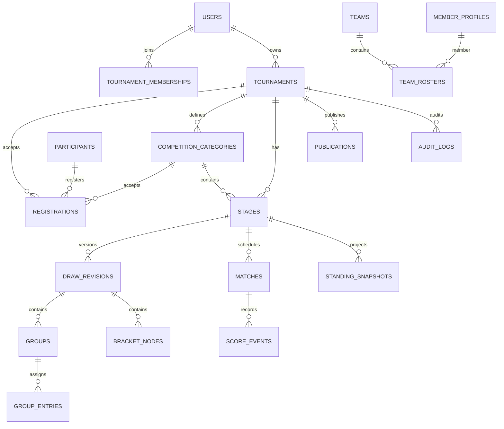

# 05 - Mô hình dữ liệu

## 1. Quy ước chung

- Primary key UUID; foreign key explicit; tên DB `snake_case`.
- Mọi mutable aggregate có `created_at`, `updated_at`, `version`; actor fields khi cần.
- Thời gian lưu `timestamptz` UTC; tournament có `timezone` IANA.
- Tiền lưu integer minor units + currency; không dùng float.
- Score/ranking dùng integer hoặc rational/decimal rõ; không dùng float cho so sánh tie-break nếu tránh được.
- Published revision, score event, audit event là append-only/immutable.
- Soft delete chỉ dùng nơi có ý nghĩa business; không thay FK bằng cascade delete tùy tiện.

## 2. Identity và entitlement

### `users`

`id`, `email_normalized` unique, `display_name`, `avatar_key`, `status`, `platform_tier`, `email_verified_at`, `terms_accepted_at`, `terms_version`, `locale`, `default_timezone`, timestamps, version.

Không lưu raw password/token. `platform_tier` là cached/basic state; entitlement service vẫn tính từ grant/subscription.

### `email_reservations`

`id`, `user_id`, `email_normalized`, kind (`CURRENT`, `PENDING`, `FORMER`), timestamps và delivery/retention metadata cần thiết. `UNIQUE(email_normalized)` là guard duy nhất xuyên mọi kind; partial unique index bảo đảm mỗi user có tối đa một `CURRENT` và một `PENDING`. Register/request/cancel/verify/cleanup cập nhật reservation và `User` trong cùng transaction. `FORMER` giữ địa chỉ cũ cho security notice, xóa sau delivery + 24 giờ hoặc safety cap 7 ngày kèm dead-letter alert.

### `password_credentials`

`user_id` unique FK, `password_hash`, `password_changed_at`, `failed_count`, `locked_until`. Hash dùng PHC Argon2id v19 chính xác theo D-026; không đặt persistent account lock chỉ từ số lần đoán sai.

### `sessions`

`id_hash`, `public_id` UUID unique, `user_id`, `created_at`, `last_seen_at`, `expires_at`, `revoked_at`, `ip_prefix_hash`, `user_agent_summary`. Index theo user/expiry; raw token chỉ ở cookie và có absolute TTL 30 ngày/idle TTL 7 ngày.

### `verification_tokens` / `password_reset_tokens`

Chỉ lưu token hash, key ID, purpose, user/reservation, `expires_at`, `used_at`, `superseded_at`, attempts; unique purpose/hash. Token public signed HMAC có version/purpose/expiry, còn DB token single-use là nguồn trạng thái chuẩn. Password change/reset supersede mọi token mở và hủy pending email trong cùng transaction.

### `subscriptions`, `entitlement_grants`, `usage_counters`

- Subscription: provider IDs unique, status, period, cancel/grace timestamps, raw event reference tối thiểu.
- Grant: tier/capability, source (`SUBSCRIPTION`, `ADMIN`, `PROMO`), start/end, reason, actor.
- Usage: subject, capability, period/bucket, value/version; quota quan trọng vẫn query/constraint từ source data khi cần.

## 3. Tournament và authorization

### `tournaments`

`id`, `owner_user_id`, `name`, `slug` unique normalized, `description`, `sport_preset_id/version`, `timezone`, `visibility`, `status`, start/end, location fields, branding JSON đã validate, `active_publication_id`, timestamps, version, archived_at.

### `tournament_memberships`

`tournament_id`, `user_id`, `role`, invite metadata, `accepted_at`, `revoked_at`, version. Unique active membership per user/tournament. Owner membership luôn tồn tại và không thể xóa nếu chưa transfer ownership.

### `invitations`

Token hash, tournament, email normalized, role, inviter, expires/accepted/revoked. Accept phải match email hoặc explicit owner override có audit.

### `venues` / `courts`

Venue thuộc tournament/organization; court có name, availability config. Unique name trong scope khi active.

### `competition_categories`

Tournament, `code`, name, participant type, eligibility/config, sport preset ref/snapshot policy, order, status, version. Unique active code trong tournament. Mỗi tournament có category mặc định; stage và registration phải cùng category.

## 4. Participant và đăng ký

### `member_profiles`

Tên thi đấu, ngày sinh/giới tính/category tùy chọn, contact private encrypted/application-protected nếu cần, public fields, linked user optional, owner scope.

### `teams`

Tên, short name, club/organization, region, logo, colors, captain profile optional, scope/owner, status.

### `team_rosters`

Team, member, tournament/category scope, shirt number, role, joined/left, eligibility. Unique active member/team/scope; policy cross-team được tournament config quyết định.

### `participants`

`type` TEAM/INDIVIDUAL, tham chiếu đúng một `team_id` hoặc `member_profile_id` bằng check constraint, display snapshot, owner/source.

### `registrations`

Tournament/category FK, participant, status, seed nullable, pot nullable, rating nullable, tags JSON/normalized mapping, checked-in, approval actor/reason, version. Unique participant/tournament/category active.

### `import_batches` / `import_rows`

File key/hash, mapping, status, counts, idempotency key, actor; row number, normalized payload, errors/warnings, created entity refs. Raw upload có retention ngắn và quyền chặt.

## 5. Preset, stage, draw và bracket

### `sport_presets`

`sport_code`, `version`, name, immutable rule JSON schema-validated, status, effective date, created actor. Unique sport/version; published preset không update.

### `stages`

Tournament, category FK, order, name, format, status, config snapshot, sport rule snapshot, active draw revision, version. Unique order/name trong category.

### `draw_revisions`

Stage, revision number, status, base revision, input snapshot JSON, input hash, algorithm/version, random seed, constraints, result checksum, validation summary, created/published actor/time. Unique stage/revision; one active published per stage enforced transactionally/partial index nếu phù hợp.

### `groups`, `group_entries`

Group thuộc revision với code/order/config. Entry trỏ participant, seed/pot, slot/order, locked, source metadata. Unique `(revision, participant)` và `(group, slot)`.

### `bracket_nodes`

Revision, round/index, node type, match optional, next node/side, loser-to node/side, display order. Constraint ngăn self-cycle; graph validation ở domain.

### `bracket_slots`

Node/side unique; source type (`PARTICIPANT`, `GROUP_RANK`, `MATCH_WINNER`, `MATCH_LOSER`, `BYE`), source ref/rank, resolved participant/version. Source fields có check constraint.

### `draw_commands`

Draft revision, command ID/idempotency, sequence, actor, type, before/after payload, timestamp. Dùng undo/audit draft; publish snapshot vẫn là chuẩn.

## 6. Schedule, match và scoring

### `matches`

Tournament/stage/revision, public ID, bracket/group/round refs, side A/B participant hoặc source refs, status, schedule start/end, venue/court, best-of/config snapshot, result type, winner, result summary, score version, result version, timestamps. Index public/tournament/status/scheduled_at.

### `match_sets`

Match, set number, status, side scores, started/ended, winner, version. Có thể là projection rebuild từ event; không là nguồn lịch sử duy nhất.

### `score_events`

Match, sequence, event UUID, idempotency key, expected/result version, type, payload schema version, actor/session, occurred/recorded time, correction target/reason. Unique match/sequence, event UUID, actor/idempotency scope. Không update/delete.

### `standing_snapshots`

Stage/group, draw revision, result projection version, calculated_at, rules version, checksum. Rows chứa participant, rank, stats JSON typed/validated, tie-break trace. Có thể rebuild; published query dùng latest consistent snapshot.

### `schedule_conflicts`

Có thể materialize warnings/overrides: match, type, severity, related resource, override actor/reason. Hard conflict vẫn enforce ở service/transaction.

## 7. Publish, communication và audit

### `publications`

Tournament, revision/version, status, public snapshot ref/checksum, published/superseded actor/time. Public read chỉ dùng active publication + live projections được phép.

### `announcements`

Tournament, title/body sanitized, status draft/scheduled/published/archived, pin, publish/expire time, author, version.

### `notifications`

Recipient user/channel/template, payload reference, status, scheduled/sent/read, dedupe key, failure. Không copy PII thừa vào payload.

### `audit_logs`

Actor user/service/admin, action code, target type/id, tournament, before/after redacted diff, reason, IP/session metadata hạn chế, correlation ID, timestamp. Append-only; index target/tournament/actor/time.

### `outbox_events`

Aggregate type/id/version, event type/schema version, payload, occurred, available, attempts, locked, processed, error. Unique aggregate/version/type hoặc event ID để retry.

Identity dùng hai schema version 1 tách biệt: `IDENTITY_TOKEN_EMAIL_REQUESTED` tham chiếu user/token/reservation + purpose; `IDENTITY_SECURITY_EMAIL_REQUESTED` tham chiếu user/reservation + notice type và không mang token. Payload không chứa recipient hoặc raw token.

### `idempotency_records`

Scope subject-HMAC/user + method + route-template + key-HMAC unique, fingerprint HMAC, key ID, trạng thái (`IN_PROGRESS`/`COMPLETED`), safe response/result reference, session public ID khi cần replay cookie, expiry 24 giờ. Không lưu raw key/password/token/cookie/email. Cùng key khác fingerprint trả `IDEMPOTENCY_CONFLICT`.

## 8. Quan hệ chính

## 9. Constraint và index tối thiểu

- Unique normalized email/slug/public ID/provider event ID.
- `email_reservations.email_normalized` unique xuyên `CURRENT/PENDING/FORMER`; partial unique mỗi user/kind active.
- Unique session `public_id`, auth token hash/purpose và idempotency scope + key-HMAC.
- Unique participant trong active registration/draw revision.
- Stage và registration phải tham chiếu category thuộc cùng tournament; service/domain kiểm và integration test transaction.
- Unique staff membership, group slot, bracket side, score sequence, draw revision number.
- Check start < end, quota/counter không âm, team-vs-individual reference đúng loại.
- Index tournament/status/time, match/tournament/status/schedule, outbox pending/available, notification pending, session expiry.
- Partial index cho active/non-revoked record nếu PostgreSQL hỗ trợ qua migration SQL review.
- FK delete behavior explicit: restrict dữ liệu thi đấu/audit; cascade chỉ cho draft child không có giá trị lịch sử.

## 10. Migration và retention

- Migration forward-only ở production; rollback chủ yếu bằng application compatibility + restore, không giả định down migration an toàn.
- Mọi destructive migration theo expand → backfill → switch → contract, có metric và backup.
- Seed sport preset idempotent theo sport/version.
- Raw import file mặc định xóa sau 30 ngày; export link hết hạn ngắn.
- Session/token/idempotency record dọn định kỳ nhưng không trước TTL contract; former email reservation tuân theo delivery + 24 giờ/safety cap 7 ngày. Audit và score event giữ theo policy pháp lý/kinh doanh, tối thiểu được nêu trong NFR.
- Xóa account pseudonymize actor nơi audit cần giữ; không phá lịch sử giải.

## 11. Data acceptance gate

- Schema diagram và migration review khớp domain invariant.
- Test direct DB + concurrency chứng minh email reservation unique xuyên flow, session public ID/token/idempotency không trùng và migration backfill fail khi có collision.
- Test constraint chứng minh không thể tạo participant trùng, score sequence trùng, publication active kép.
- Transaction test chứng minh command + audit + outbox atomic.
- Replay score events và rebuild standings cho checksum giống nhau.
- Public DTO snapshot không chứa email, token, private contact hoặc internal note.
